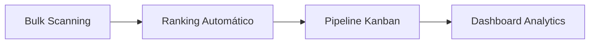
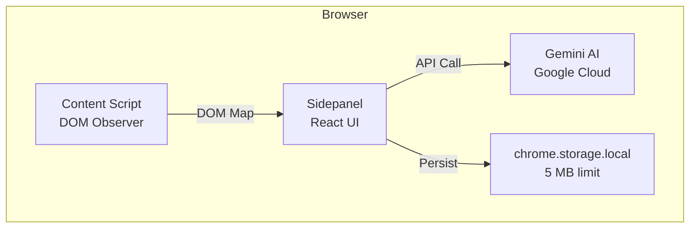
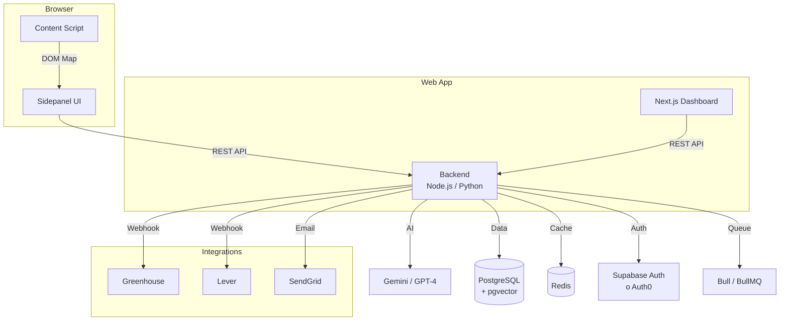

# 🔎 TalentScout MCP — Análisis Estratégico

> Análisis completo de mejoras técnicas, oportunidades de negocio y estrategia de escalabilidad.

---

## 1. Estado Actual del Producto

### ¿Qué es hoy?
Una **Chrome Extension** (WXT + React + Tailwind) que actúa como asistente de reclutamiento potenciado por **Gemini AI**. Funciona como un sidepanel del navegador.

### Funcionalidades actuales

| Feature | Descripción | Madurez |
|---------|------------|---------|
| **DOM Scraping** | Extrae el DOM visible de perfiles (LinkedIn, Indeed, otros) y lo envía a Gemini | ✅ Funcional |
| **Extracción de Perfiles** | Gemini parsea el DOM Map y devuelve un `CandidateProfile` estructurado | ✅ Funcional |
| **Job-Fit Analysis** | Compara candidato vs Job Description y genera score 0-100 + gaps/strengths | ✅ Funcional |
| **Icebreaker Generator** | Genera mensajes de outreach hiper-personalizados para contacto | ✅ Funcional |
| **Mini-ATS** | Gestión de "Llamados" (JobPost) con candidatos asociados | ✅ Funcional |
| **CSV Export** | Exportación de candidatos con delimitador `;` para Excel ES/LatAm | ✅ Funcional |
| **Persistencia** | `chrome.storage.local` (5 MB) con monitoreo de uso | ✅ Funcional |
| **Dark Mode** | Toggle claro/oscuro persistido en localStorage | ✅ Funcional |

### Stack Tecnológico

```
WXT (Chrome Extension Framework)
├── React 19 + TypeScript
├── Tailwind CSS 3
├── Google Generative AI SDK (@google/generative-ai)
├── Lucide React (iconos)
└── chrome.storage.local/sync (persistencia)
```

---

## 2. Mejoras Técnicas (Quick Wins)

Mejoras que no cambian el producto pero lo hacen significativamente mejor.

### 🔴 Críticas

| # | Mejora | Impacto | Esfuerzo |
|---|--------|---------|----------|
| 1 | **Backend propio** para almacenar datos — `chrome.storage.local` tiene un límite de **5 MB** que se llenará con ~50-100 candidatos con perfiles ricos | Elimina un techo de producto | Alto |
| 2 | **Autenticación de usuarios** — hoy no hay concepto de "usuario", cualquier persona con la extensión puede usarla | Requisito para monetización | Alto |
| 3 | **Manejo de errores robusto** — La función `safeParseJSON` es frágil si Gemini cambia formato | Estabilidad | Bajo |

### 🟡 Importantes

| # | Mejora | Impacto | Esfuerzo |
|---|--------|---------|----------|
| 4 | **Soporte multi-fuente** — `dom_observer.ts` tiene selectores optimizados solo para LinkedIn; agregar parsers específicos para Indeed, Glassdoor, GitHub | Más cobertura | Medio |
| 5 | **Caché de análisis** — Si un usuario escanea el mismo perfil 2 veces, no debería llamar a Gemini de nuevo | Ahorra API calls y dinero | Bajo |
| 6 | **Exportar a más formatos** — Agregar JSON, XLSX nativo, y PDF con diseño profesional | Profesionalización | Medio |
| 7 | **Keyboard shortcuts** — `Ctrl+Shift+S` para escanear, `Ctrl+Shift+F` para fit, etc. | UX power-users | Bajo |
| 8 | **Notificaciones push** — Notificar cuando un candidato actualiza su perfil (requiere background polling) | Engagement | Alto |

### 🟢 Nice to Have

| # | Mejora | Impacto | Esfuerzo |
|---|--------|---------|----------|
| 9 | **i18n** — Internacionalización (inglés, portugués) para expandir mercado | Mercado global | Medio |
| 10 | **Tests unitarios y E2E** — El proyecto no tiene tests; agregar Vitest + Playwright | Calidad | Medio |
| 11 | **Pipeline de estados** — Expandir `new → contacted → saved` a un pipeline Kanban completo | UX | Medio |

---

## 3. Oportunidades de Producto (Feature Roadmap)

### Fase 1 — "Power Recruiter" (1-2 meses)



| Feature | Descripción |
|---------|------------|
| **Bulk Scanning** | Escanear una página de resultados de LinkedIn Search y extraer **N perfiles** automáticamente. Hoy solo funciona perfil por perfil. |
| **Ranking automático** | Dado un Llamado, ordenar todos los candidatos por score de fit, mostrando el "top 5" en un dashboard. |
| **Pipeline Kanban** | Vista Kanban con columnas: `Nuevo → Revisado → Contactado → Entrevista → Oferta → Rechazado`. Drag & drop. |
| **Dashboard de Analytics** | Métricas: candidatos escaneados por semana, tiempo promedio de pipeline, tasa de respuesta a outreach. |

### Fase 2 — "Team Edition" (3-4 meses)

| Feature | Descripción |
|---------|------------|
| **Backend + Auth** | Migrar de `chrome.storage.local` a un backend real (Supabase/Firebase) con autenticación. |
| **Equipos** | Múltiples reclutadores comparten la misma base de candidatos y llamados. |
| **Notas y comentarios** | Cada candidato tiene un hilo de notas internas del equipo. |
| **Historial de interacciones** | Log de cuándo fue contactado, qué se le dijo, si respondió. |
| **Integraciones** | Exportar a ATS existentes: Greenhouse, Lever, Workday, BambooHR vía API/Webhooks. |

### Fase 3 — "Intelligence Platform" (6+ meses)

| Feature | Descripción |
|---------|------------|
| **Talent Pool** | Base de datos persistente de todos los candidatos escaneados, buscable por skills/ubicación/score. |
| **Match Recomendado** | Cuando se crea un nuevo Llamado, la plataforma sugiere candidatos del pool que ya hacen match. |
| **Outreach Sequences** | Cadenas de mensajes automáticos (día 1: icebreaker, día 3: follow-up, día 7: último intento). |
| **Análisis de mercado** | "Para este rol en Buenos Aires, el score promedio de candidatos es 62. El skill más escaso es Kubernetes." |
| **Chrome Extension → Web App** | Complementar la extensión con una web app completa para gestión avanzada. |

---

## 4. Modelos de Monetización

### Opción A — Freemium con Créditos

| Tier | Precio | Incluye |
|------|--------|---------|
| **Free** | $0 | 10 scans/mes, 5 análisis de fit, 3 icebreakers |
| **Pro** | $29/mes | Scans ilimitados, fit ilimitado, bulk scanning, CSV/XLSX export |
| **Team** | $19/usuario/mes (mín. 3) | Todo lo de Pro + colaboración, notas, pipeline compartido |
| **Enterprise** | Custom | SSO, integraciones ATS, API access, soporte dedicado |

> [!TIP]
> **El modelo de créditos es ideal porque el costo real es proporcional al uso de la API de Gemini.** Cada scan ~ $0.001-0.003 en tokens de Gemini Flash. El margen es enorme.

### Opción B — Marketplace de Templates

Vender "prompt packs" o templates de Icebreaker para industrias específicas:
- Pack Tech Recruiting ($9.99)
- Pack Healthcare ($9.99)
- Pack Sales/BizDev ($9.99)

### Opción C — API as a Service

Exponer la lógica de extracción + fit analysis como API REST para que otros ATS la consuman:
```
POST /api/v1/extract-profile  →  body: { html: "..." }  →  CandidateProfile
POST /api/v1/analyze-fit      →  body: { profile, jobDescription }  →  JobFitResult
```
Pricing: $0.05/call o paquetes de calls.

---

## 5. Arquitectura de Escalabilidad

### Hoy (v1 — Chrome Extension Local)



### Futuro (v2 — Platform)



### Decisiones clave para escalar

| Decisión | Recomendación | Por qué |
|----------|--------------|---------|
| **Base de datos** | PostgreSQL + pgvector | Pgvector permite búsqueda semántica de candidatos por embeddings de skills |
| **Backend** | Node.js (Fastify) o Python (FastAPI) | Reutiliza el conocimiento TypeScript del equipo, o Python para mejor ecosistema de AI |
| **Auth** | Supabase Auth o Clerk | Menor fricción, integración con extensiones Chrome |
| **Queue** | BullMQ (Redis) | Para bulk scanning asíncrono de N perfiles |
| **Hosting** | Railway / Fly.io / Vercel | Deploy rápido, costos bajos al inicio |
| **AI Provider** | Multi-modelo (Gemini + OpenAI fallback) | Resiliencia y flexibilidad de costos |

---

## 6. Análisis Competitivo

### Competidores directos

| Producto | Qué hace | Precio | Debilidad que TalentScout explota |
|----------|----------|--------|----------------------------------|
| **LinkedIn Recruiter** | Búsqueda avanzada + InMail | $170+/mes | No tiene AI fit analysis ni icebreaker personalizado |
| **Hiretual / hireEZ** | Sourcing AI multi-plataforma | $199+/mes | Demasiado caro para freelancers/PYMEs |
| **Dux-Soup** | Automatización de LinkedIn | $15-55/mes | Solo automatiza, no analiza ni genera contenido |
| **Octopus CRM** | LinkedIn automation | $10-25/mes | Sin inteligencia artificial real |
| **Crystal Knows** | Personality insights | $49+/mes | Solo personalidad, no fit técnico |

### Diferenciador de TalentScout

> [!IMPORTANT]
> **TalentScout combina 3 capacidades que normalmente están en herramientas separadas:**
> 1. **Extracción** (lo que hacen los scrapers)
> 2. **Análisis inteligente** (lo que hacen los ATS premium)
> 3. **Generación de outreach** (lo que hacen las herramientas de copywriting)
>
> Todo esto a una fracción del costo, desde una Chrome Extension ligera.

### Segmentos target prioritarios

| Segmento | Tamaño | Disposición a pagar | Prioridad |
|----------|--------|---------------------|-----------|
| **Recruiters freelance** (LATAM) | ~50K | $15-30/mes | 🥇 Alta |
| **Startups sin RRHH** (fundadores que contratan) | ~200K+ | $20-40/mes | 🥇 Alta |
| **Agencias de recruiting** (5-20 personas) | ~15K | $15-25/usuario/mes | 🥈 Media |
| **RRHH corporativo** (complemento a su ATS) | Enterprise | Custom | 🥉 Futuro |

---

## 7. Go-to-Market — Primeros 90 Días

### Semana 1-2: Lanzamiento MVP
- [ ] Publicar en **Chrome Web Store** (tier Free)
- [ ] Landing page con demo video (30 seg)
- [ ] Post en LinkedIn del creador + Red de recruiters

### Semana 3-6: Community Building
- [ ] Ofrecer **acceso Pro gratis** a 50 beta testers (recruiters reales)
- [ ] Recopilar feedback y testimonios
- [ ] Publicar en **Product Hunt**
- [ ] Crear contenido en LinkedIn: "Cómo uso IA para reclutar 3x más rápido"

### Semana 7-12: Monetización
- [ ] Activar paywall (Stripe / Lemonsqueezy)
- [ ] Lanzar tier Pro con pricing definitivo
- [ ] Programa de referidos (1 mes gratis por cada referido que pague)
- [ ] Partnerships con bootcamps/academias de RRHH en LATAM

---

## 8. Riesgos y Mitigaciones

| Riesgo | Probabilidad | Impacto | Mitigación |
|--------|-------------|---------|------------|
| **LinkedIn bloquea scraping** | Media | Alto | Diversificar fuentes (Indeed, GitHub, búsqueda libre). Usar técnicas no invasivas (DOM reading, no API abuse) |
| **Google cambia pricing de Gemini** | Media | Medio | Abstracción multi-modelo (OpenAI fallback). El costo actual es negligible |
| **Chrome Web Store rechaza la extensión** | Baja | Alto | Cumplir estrictamente con las políticas. No automatizar interacciones, solo leer DOM |
| **Competidores grandes copian features** | Media | Medio | Velocidad de iteración + foco en LATAM como nicho geográfico |
| **Datos personales y GDPR/LGPD** | Alta | Alto | Privacy policy clara. No almacenar datos sin consentimiento. Opt-out fácil |

---

## 9. Próximos Pasos Recomendados

> [!IMPORTANT]
> **Top 5 acciones inmediatas, ordenadas por impacto/esfuerzo:**

1. **🧪 Agregar tests** — El proyecto tiene 0 tests. Agregar Vitest para unit tests de `gemini.ts`, `csv_exporter.ts`, y `useCandidateStore.ts`. Esto es fundamental antes de escalar.

2. **📦 Publicar en Chrome Web Store** — La extensión está lista para un MVP público. Crear assets (screenshots, descripción, privacy policy) y publicar dentro del tier Free.

3. **💾 Migrar a Supabase** — Reemplazar `chrome.storage.local` por Supabase (PostgreSQL + Auth + Realtime). Esto desbloquea: usuarios, equipos, datos ilimitados, y búsqueda avanzada.

4. **📊 Bulk Scanning** — Es la feature más pedida por recruiters: escanear una página de resultados de búsqueda y obtener N candidatos de una. Diferenciador enorme.

5. **💰 Paywall simple** — Integrar Lemonsqueezy/Stripe con un límite de 10 scans/mes gratuitos. Permite validar willingness-to-pay antes de invertir más.
